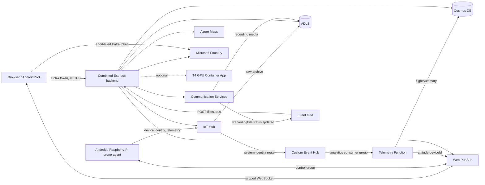

# Project architecture

## Purpose

Dronefleet is a remote piloting and drone-management platform. Native Android and Raspberry Pi agents connect aircraft to Azure; pilots use a browser or AndroidPilot client. The cloud backend authenticates pilots, assigns exclusive control leases, sends commands, persists identities and flight records, brokers ACS video, records media, and fans out telemetry.

This repository owns the repeatable Azure platform. It intentionally does not contain phone signing keys, drone certificates, production data, or shared secrets.

## Runtime flow

## Resource ownership

### Identity and authorization

`scripts/bootstrap-entra.ps1` creates two Entra registrations:

- **API app**: exposes delegated scope `Drone.Provision`.
- **Public client app**: browser SPA and Android redirects; requests the API scope.

Bicep creates one user-assigned managed identity for server-side workloads. It receives only required roles:

- Cosmos DB Built-in Data Contributor
- Storage Blob/Queue/Table data roles
- Event Hubs Data Receiver and Sender
- Web PubSub Service Owner
- IoT Hub Data Reader
- Cognitive Services OpenAI User, Cognitive Services User, and Foundry User when enabled
- AcrPull for the GPU detector image
- Key Vault Secrets User

### Realtime messaging

IoT Hub is the trusted device-ingress boundary. Its system identity routes telemetry to the private custom Event Hub. The forwarder consumes that hub under consumer group `analytics` with managed identity, prefers IoT-authenticated device metadata when available, then publishes to `attitude-<deviceId>`. The IoT Hub built-in endpoint is not used because message consumption there requires a shared-access connection string.

The combined backend issues scoped Web PubSub client tokens. Pilots may join only their assigned telemetry/detection groups and send only to their assigned control groups. The VNet-integrated forwarder also upserts `flightSummary` messages into the private Cosmos `flights` container.

### Durable data

Cosmos database `droneOps` contains:

| Container | Partition key | Purpose |
|---|---|---|
| `telemetry` | `/deviceId` | General telemetry/analytics compatibility |
| `identities` | `/appUserId` | ACS identity mappings |
| `rooms` | `/roomId` | Durable ACS rooms and participants |
| `devices` | `/deviceId` | Drone-to-ACS mappings |
| `pilotAssignments` | `/pilotId` | Pilot authorization boundaries |
| `installations` | `/deviceId` | Android installation enrollment |
| `enrollmentBundles` | `/deviceId` | One-time sideload enrollment bundles |
| `controlClaims` | `/deviceId` | Exclusive pilot control leases |
| `flights` | `/deviceId` | Function-persisted arm-to-disarm summaries |

The deployment creates the database and containers only. It never creates pilot
assignment documents. A tenant-specific bootstrap identity is recognized as an
administrator independently of assignments, then manages pilot access through
the admin API/UI.

ADLS containers:

- `drone-analytics`
- `drone-snapshots`
- `recordings`
- `iothub-dronelogs`

### Video and media

The backend creates ACS identities and rooms, issues short-lived tokens, and starts per-drone recordings only when a browser or Android pilot requests recording. Event Grid does not start recordings.

By default, the backend supplies the generated ADLS Blob container URL ending in `/recordings`. ACS uses its system-assigned managed identity and the Storage Blob Data Contributor role to export media directly there. An optional external destination URL can override the default; that external storage account must separately grant the deployed ACS identity Storage Blob Data Contributor.

After export, an Event Grid subscription sends `Microsoft.Communication.RecordingFileStatusUpdated` to the backend `/filestatus` webhook. `postdeploy.bicep` creates this subscription only after backend code is live because Event Grid validates the webhook during creation. The `recordingStateCallbackEndpointUrl` supplied to Call Automation also points to `/filestatus`; that callback and Event Grid notification are complementary.

The ACS, IoT Hub service, Web PubSub, and Maps SDK paths currently require service credentials; Bicep generates those credentials into Key Vault and App Service uses Key Vault references. They never enter source control or phone packages.

### Networking

`networkIsolation = 'privateEndpoint'` creates private endpoints and private DNS for application traffic from App Service and the Function. Key Vault remains private-only.

IoT Hub message routing is a separate Azure service egress path. Azure requires routing to use destination public endpoints, so storage and Event Hubs keep public networking enabled behind deny-by-default firewalls. The IoT Hub system-assigned identity receives destination data roles, and both services enable the trusted Microsoft services exception. General internet clients remain blocked. Cosmos stays private; the Function writes flight summaries over its VNet integration.

`serviceEndpoint` is a lower-cost development mode. Data services retain public FQDNs but firewall them to the platform subnets.

## Deployment layers

1. Subscription deployment creates `rg-<namePrefix>`.
2. Foundation creates monitoring, identity, networking, DNS, and Key Vault.
3. Data/messaging creates Cosmos, ADLS, Event Hubs, Web PubSub, and their roles.
4. IoT Hub is created with a system-assigned identity; destination roles and trusted-service firewall exceptions are applied next; routing is configured last.
5. Compute creates the telemetry Function and combined backend App Service on one shared P0v3 plan.
6. Key Vault secrets and runtime app settings connect services.
7. Code deployment publishes the Express application and telemetry Function.
8. Post-code deployment validates `/filestatus` and creates the ACS Event Grid recording-status subscription.
9. Entra callback completion, Android rebuilds, device provisioning, and pilot assignments finish the environment.

## Portability boundaries

### Included and automated

Core Azure resources, networking, roles, service-generated secrets, IoT routes, Cosmos schema, storage containers, backend host settings, and telemetry Function source.

### Environment-specific but scripted

Entra app registrations and redirect URIs. Graph objects live at tenant scope and are managed by `bootstrap-entra.ps1`.

### Environment data

IoT device identities/certificates, pilot-to-drone assignments, ACS room records, installation enrollment bundles, and existing flight history. Recreating infrastructure does not copy production data.

### Foundry and GPU inference

The main deployment creates a Microsoft Foundry account/project in East US 2 with usage-based `gpt-5.1` snapshot-analysis and `gpt-realtime` voice deployments. The backend invokes the stable `vision-chat` deployment with managed identity. Voice Live is a direct browser WebSocket, so the browser receives a short-lived Entra token from Express; Foundry keys remain disabled. Azure may upgrade versions within the selected model family according to `foundryChatVersionUpgradeOption`; migration to a different family remains an explicit, tested template release.

The optional detector uses an 8-vCPU/56-GiB `Consumption-GPU-NC8as-T4` Container Apps profile in South Central US, the deployment-created ACR, Key Vault-backed `AI_SHARED_KEY` and Web PubSub connection string, managed-identity image pull, and scale-to-zero with `maxReplicas = 1`. Bicep also sets the target hub and `detections` per-device group prefix. Deployment is intentionally staged so `ai-detection:t4-v8` is imported before the app references it.

South Central regional support is available, but the destination subscription must first receive Managed Environment Consumption T4 GPU quota. The operator must also retain an appropriate Ultralytics AGPL or commercial-license posture for the detector image.
